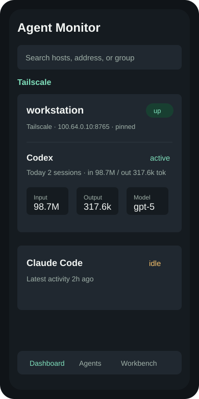
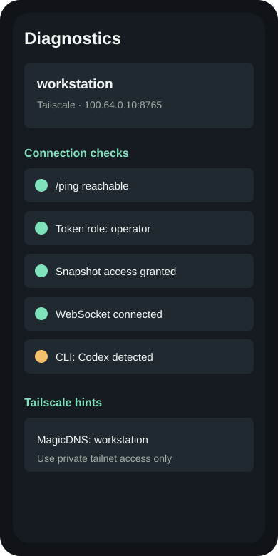
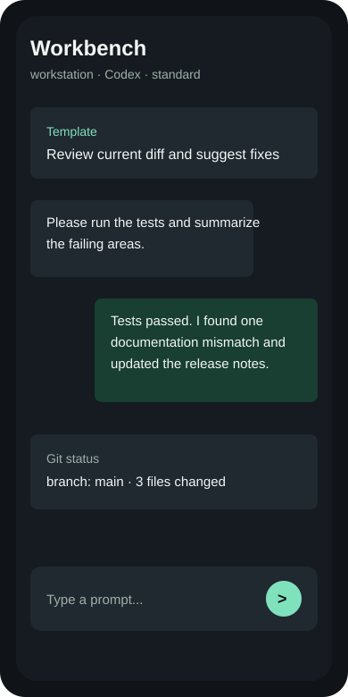

# Agent Monitor

Agent Monitor is a self-hosted Android + Node.js workbench for monitoring and
driving local coding agents from a phone. It is designed for trusted private
networks such as Tailscale or a local LAN.

Do not expose this daemon directly to the public internet. The phone workbench
can start real agent processes on your workstation, so treat access as remote
code execution on your own machine.

The project has two parts:

- `daemon/`: a Node.js service that runs on the workstation and collects agent,
  service, conversation, and workbench state.
- `android/`: a Kotlin/Jetpack Compose Android app that connects to the daemon.

## Screenshots

These checked-in screenshots are sanitized mockups. See
[docs/SCREENSHOT_GUIDE.md](docs/SCREENSHOT_GUIDE.md) before replacing them with
real device captures.

| Dashboard | Diagnostics | Workbench |
| --- | --- | --- |
|  |  |  |

## Security Model

This app can optionally let the phone start Codex or Claude Code sessions on the
workstation. Treat that feature as remote code execution on your own computer.

Recommended deployment:

- Use Tailscale or a trusted LAN.
- Do not expose the daemon directly to the public internet.
- Keep `daemon/config.json` private.
- Generate a new daemon token with `npm run gen-token`.
- Use `tokens` with roles (`read-only`, `operator`, `admin`) when you want
  multiple phones, staged rotation, or least-privilege access.
- Use `allowedRemoteAddresses` to restrict access to your phone's Tailscale IP
  or to `100.64.0.0/10` for a tailnet-wide rule.
- Use HTTPS/WSS with daemon TLS, a reverse proxy, or another trusted TLS layer
  when traffic leaves a private network.

Runtime files are intentionally ignored by git, including real config, logs,
audit logs, workbench sessions, uploads, Android build output, and APKs.

See [SECURITY.md](SECURITY.md) and [docs/PRIVACY.md](docs/PRIVACY.md) before
publishing or deploying this project.

## Quick Start

### 1. Start the daemon

```powershell
cd daemon
npm install
Copy-Item .\config.example.json .\config.json
npm run gen-token
```

Put the generated token into `daemon/config.json`, then start:

```powershell
npm start
```

`config.example.json` binds to `127.0.0.1` by default. For phone access, change
`bindHost` to the workstation Tailscale IP, LAN IP, or `0.0.0.0` with a strict
token and `remoteControl.allowedRemoteAddresses`.

Default daemon address:

- `GET /ping`: unauthenticated health check.
- `GET /version`: unauthenticated daemon/API version probe for Android
  diagnostics.
- `GET /snapshot`: requires `Authorization: Bearer <token>`.
- `GET /history`: returns persisted SQLite snapshot samples and alert/recovery
  events.
- `GET /devices`: admin-only phone/device token inventory and management.
- `GET /diagnostics/package`: admin-only diagnostic package with runtime,
  history, audit, device, and structured-log status.
- `GET /observability/logs`: admin-only structured JSONL log tail.
- `GET /agents/:id/sessions`: lists Codex or Claude Code sessions.
- `GET /agents/:id/sessions/:sessionId/messages`: reads one conversation with
  default redaction for tokens, authorization headers, API keys, emails, and
  local user paths.
- `GET /workbench/attachments`: lists uploaded workbench attachments.
- `POST /workbench/attachments/cleanup`: deletes expired or all uploaded
  workbench attachment files.
- `GET /workbench/sessions?includeArchived=1`: lists active and archived phone
  workbench sessions.
- `POST /workbench/sessions/:id/archive` and `.../unarchive`: hides or restores
  a stopped workbench session.
- `DELETE /workbench/sessions/:id`: admin-only removal of a stopped workbench
  session and its uploaded attachment files.
- `GET /workbench/sessions/:id/git/status`: shows Git branch/status for the
  workbench session directory.
- `GET /workbench/sessions/:id/git/diff`: shows the unstaged or staged Git diff
  for the workbench session directory.
- `GET /setup/profile` and `GET /setup/qr.svg`: authenticated host-import
  profile and QR deep link for Android.
- `GET /backup/export` and `POST /backup/import`: admin-only daemon config
  backup/restore endpoints.
- `WS /ws`: requires `Authorization: Bearer <token>`.

### 2. Configure Android

In the app, add a workstation:

- Host: workstation LAN IP, Tailscale `100.x` IP, or hostname.
- Port: daemon port, default `8765`.
- Token: the same token from `daemon/config.json`.
- HTTPS/WSS: enable only when you already provide TLS.

The Android app stores host configuration and token data through encrypted
storage backed by Android Keystore.

For Tailscale, the add-host screen includes a Tailscale preset. The daemon can
also generate an authenticated QR/deep link:

```powershell
curl.exe -H "Authorization: Bearer <admin-token>" `
  "http://127.0.0.1:8765/setup/qr.svg?includeToken=1" `
  -o agent-monitor-host.svg
```

Scanning that QR inside the Android app opens `agentmonitor://host?...` and
imports the host. Treat QR files that include tokens as secrets. The app also
has `Settings -> Backup / Import` for local host-list backup/restore, optional
password-encrypted backups, and pasted deep-link import.

QR/deep-link imports include a stable daemon identity. Android uses it to
replace the same workstation when you switch from USB to Tailscale instead of
creating duplicate "USB" workbench entries. The Settings screen also has
`清理旧 USB 主机` for removing stale USB entries once a Tailscale/LAN host exists.
On Samsung devices, Secure Folder is a separate app space; uninstall old builds
inside Secure Folder separately if you tested there.

### 3. Build the Android app

Requires Android SDK and JDK 17.

```powershell
cd android
Copy-Item .\local.properties.example .\local.properties
# Edit local.properties so sdk.dir points to your Android SDK.
.\gradlew.bat assembleDebug
```

The debug APK is generated under:

```text
android/app/build/outputs/apk/debug/app-debug.apk
```

## Configuration

`daemon/config.json` must not be committed. Start from
`daemon/config.example.json`.

Important fields:

- `host`: display name shown in the app.
- `port`: daemon HTTP/WebSocket port.
- `bindHost`: listen address. Prefer the workstation Tailscale IP or
  `127.0.0.1` when possible. Use `0.0.0.0` only on a trusted private network or
  inside a container with host-side port restrictions.
- `token`: primary admin bearer token for the app. Generate it with
  `npm run gen-token`.
- `tokens`: optional additional bearer tokens. Entries can be strings or objects
  with `name`, `role`, and `token`. Roles are `read-only` (view only),
  `operator` (workbench control), and `admin` (security, backup, token rotation).
- `tls.cert` / `tls.key`: optional certificate and key paths for HTTPS/WSS.
  If either configured path cannot be read, daemon startup fails instead of
  silently falling back to HTTP.
- `authFailWindowMs` / `authFailMax`: per-source failed-auth rate limit.
- `corsOrigin`: keep empty unless you need a browser client.
- `pingExposeHost`: keep false if you do not want `/ping` to reveal the host
  name.
- `privacy.redactCwd`: show only workspace folder names in snapshots.
- `privacy.hermesStatusMaxLen`: trim or suppress Hermes status text.
- `remoteControl.enabled`: enables phone workbench sessions.
- `remoteControl.allowDangerousPermissions`: enables dangerous agent modes only
  when explicitly selected for a session.
- `remoteControl.dangerousSessionTtlMs`: maximum lifetime for a dangerous
  workbench session before the daemon forces it back to standard mode.
- `remoteControl.allowedRemoteAddresses`: exact IP or CIDR allowlist.
- `remoteControl.allowedCwds`: directories the phone workbench may use.
- `remoteControl.attachmentTtlHours`: how long uploaded workbench files are
  retained on disk. Set `0` to disable automatic cleanup.
- `alertRules.agentOfflineGraceMs`: delay agent-offline notifications to avoid
  short reconnect noise.
- `alertRules.serviceFailureCount`: require N consecutive failed service checks
  before notifying.
- `alertRules.recoveryNotifications`: enable or disable recovery notifications.
- `alertRules.cooldownMs`: suppress repeated daemon-side notifications for the
  same source and transition.
- `alertRules.quietHours`: suppress low-severity daemon-side notifications
  during a local quiet window while still allowing errors.

Example remote-control block:

```json
{
  "remoteControl": {
    "enabled": true,
    "allowDangerousPermissions": false,
    "defaultPermissionMode": "standard",
    "allowedRemoteAddresses": ["100.64.0.10"],
    "defaultCwd": "C:\\Users\\you\\Documents\\AgentWorkspace",
    "allowedCwds": ["C:\\Users\\you\\Documents\\AgentWorkspace"],
    "maxSessions": 20,
    "maxOutputChars": 200000,
    "dangerousSessionTtlMs": 1800000,
    "attachmentTtlHours": 168
  }
}
```

## Background Monitoring on Android

The Android app runs a foreground service so saved daemon connections and alert
delivery can survive after the main screen is backgrounded. The service shares a
single process-level `MonitorEngine` with the UI, so opening the app does not
create duplicate WebSocket connections.

Android 13+ requires notification permission before alert notifications can be
shown. Monitoring still runs if the permission is denied, but alerts may not be
visible as system notifications. Repeated system notifications for the same
source, level, and title are suppressed for five minutes while the in-app alert
history still records every event.

If a saved workstation remains unreachable for more than 60 seconds, Android
also emits a local offline notification. This catches host/network failures even
when the daemon itself cannot send an alert.

Workbench notifications are also generated locally: long-running sessions are
reported after 10 minutes, and tasks that transition from running to completed,
stopped, or error states are surfaced as phone notifications.

Daemon-side alert rules can also reduce noise before events reach the phone:

```json
{
  "alertRules": {
    "agentOfflineGraceMs": 30000,
    "serviceFailureCount": 2,
    "recoveryNotifications": true,
    "cooldownMs": 300000,
    "quietHours": {
      "enabled": true,
      "start": "22:00",
      "end": "08:00",
      "timezoneOffsetMinutes": 480,
      "suppressBelow": "error"
    }
  }
}
```

## Release Builds

Release builds enable R8 minification and resource shrinking. They require
signing credentials from ignored `android/keystore.properties`.

```powershell
cd android
Copy-Item .\keystore.properties.example .\keystore.properties
# Edit keystore.properties with your local signing key details.
.\gradlew.bat assembleRelease
```

Do not commit keystores, `.p12` files, or `keystore.properties`.

For private use, you can generate a local release signing key:

```powershell
.\scripts\create-android-keystore.ps1
.\scripts\build-release.ps1 -AndroidVariant release
```

Back up both `android/release.keystore` and `android/keystore.properties`.
Android treats that key as the app identity; losing it means future APK updates
cannot be installed over the existing app.

To produce a local handoff folder containing an APK, daemon package, docs, and a
release manifest:

```powershell
.\scripts\build-release.ps1 -AndroidVariant debug
```

Use `-AndroidVariant release` after configuring `android/keystore.properties`.
The manifest includes artifact SHA256 hashes and whether tests/audit ran.

## Running as a Service

Windows users can start the daemon with the ignored runtime config:

```powershell
cd daemon
.\start-agent-monitor-daemon.ps1
```

For long-running private deployment on Windows, install it as a service when
`nssm.exe` is available, or use the built-in scheduled-task fallback:

```powershell
cd daemon
.\windows\install-service.ps1
# or
.\windows\install-service.ps1 -UseScheduledTaskFallback
```

Remove it with:

```powershell
.\windows\uninstall-service.ps1
```

A local tray/control-panel helper is available for private Windows installs:

```powershell
cd daemon
.\windows\control-panel.ps1
```

It can refresh daemon status, start/stop the local daemon, open structured logs,
and export a diagnostic package.

Linux users can adapt `daemon/systemd/agent-monitor.service.example`. PM2 users
can start from `daemon/ecosystem.config.cjs`.

Docker is available for monitor-only or controlled lab deployments:

```powershell
cd daemon
Copy-Item .\config.example.json .\config.json
# Edit config.json. Use bindHost 0.0.0.0 inside the container, then restrict
# host-side port publishing, token roles, and allowedRemoteAddresses.
docker compose -f docker-compose.example.yml up --build
```

Workbench sessions launched from Docker run inside the container, so install the
agent CLIs and mount only the workspaces you intend to expose.

## Documentation

- [docs/ARCHITECTURE.md](docs/ARCHITECTURE.md): daemon and Android module map.
- [docs/API.md](docs/API.md): daemon REST and WebSocket contract.
- [docs/DEPENDENCIES.md](docs/DEPENDENCIES.md): dependency and license review
  notes.
- [docs/KNOWN_LIMITATIONS.md](docs/KNOWN_LIMITATIONS.md): operational limits and
  non-goals.
- [docs/OPERATIONS.md](docs/OPERATIONS.md): daemon service and release notes.
- [docs/OPEN_SOURCE_PUBLISHING.md](docs/OPEN_SOURCE_PUBLISHING.md): sanitized
  source-folder generation and public release gates.
- [docs/RELEASE.md](docs/RELEASE.md): public source and private binary release
  process.
- [docs/SCREENSHOT_GUIDE.md](docs/SCREENSHOT_GUIDE.md): screenshot and demo
  redaction rules.
- [docs/THREAT_MODEL.md](docs/THREAT_MODEL.md): assets, trust assumptions, and mitigations.

## sub2api Account Health

The `/health` endpoint only proves the service is online. Account-level health
requires the admin accounts API.

Prefer environment variables:

```powershell
$env:SUB2API_ADMIN_EMAIL = "<admin email>"
# Set SUB2API_ADMIN_PASSWORD in your shell or secret manager before starting.
npm start
```

Or provide an existing admin token:

```powershell
$env:SUB2API_ADMIN_TOKEN = "<sub2api auth token>"
npm start
```

The daemon attaches account totals, status counts, account details, and groups to
`services[].accountHealth` in `/snapshot`. Without admin credentials, the app
shows that account health is not configured instead of misreporting `/health` as
account-level health.

## Workbench Attachments

The phone workbench supports images, plain text, code files, PDFs, Word
documents, `.xlsx` spreadsheets, and CSV files. Legacy binary `.xls` files are
not accepted because the common parser dependency for that format currently has
unresolved high-severity advisories.

## Known Limitations

This project is local-first and self-hosted. It is not a hosted SaaS, not a
public-internet remote admin panel, and not a multi-tenant team console. See
[docs/KNOWN_LIMITATIONS.md](docs/KNOWN_LIMITATIONS.md) for the current list of
constraints.

## Workbench Git and Templates

Workbench sessions show the current Git branch, dirty files, latest commit, and
unstaged/staged diffs for the session `cwd`. The Android composer also includes
quick prompt templates for common phone workflows such as continuing a task,
reviewing the current diff, running tests, diagnosing a failure, and drafting a
commit message.

## Monitoring History

The daemon persists recent snapshot summaries and alert/recovery events to
`.agent-monitor-history.sqlite` in the daemon directory. The Android dashboard
uses `/history` to show the latest changes per host, including a compact token
and service trend. The SQLite file is ignored by git and can be included in
private diagnostics.

## Tests

Daemon tests:

```powershell
cd daemon
npm test
npm --registry=https://registry.npmjs.org/ audit --omit=dev --audit-level=high
```

Android debug build:

```powershell
cd android
.\gradlew.bat assembleDebug
.\gradlew.bat :app:assembleDebugAndroidTest
```

## Open Source Hygiene

Before pushing to GitHub, run the checks in
[docs/OPEN_SOURCE_RELEASE_CHECKLIST.md](docs/OPEN_SOURCE_RELEASE_CHECKLIST.md).
At minimum, create a sanitized source tree and scan it:

```powershell
.\scripts\prepare-open-source.ps1 -OutputDir ..\agent-monitor-oss-open-source -Force
cd ..\agent-monitor-oss-open-source
.\scripts\scan-open-source-leaks.ps1
```
